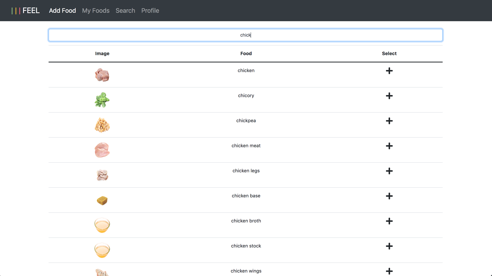

# Feel 
> How does food make you feel?

## General info
For this experiment, you're stomach is the test subject. Track how food makes you feel. Discover how food makes others feel. This is the first web app that attempts to collect data on how individual foods make us humans feel. Powered by the Spoonacular API you can search for foods, add them, and report how they made you feel. 

## Inspiration
Due to cancer, my girlfriend had to have her stomach removed. For the first couple months, discovering what foods settled well with her gastrointestinal tract was difficult. I wanted to make an app where people with various gastrointestinal issues could record how certain foods make them feel. Even more importantly they can learn from others by viewing how certain foods make people with certain disorders feel. 

## Screenshots

## Technologies
* HTML5
* CSS3
* Javascript
* Python
* Flask 
* Jinja
* SQLAlchemy
* PostgreSQL
* WTForms

## Use
[Click Here](https://ifeelapp.herokuapp.com/)

## Skills practiced
* Routing
* Sending / consuming JSON
* Form submission
* DOM manipulation
* CSS styling and animation

## API 
* https://spoonacular.com/food-api/docs#Ingredient-Search

## Status
Project is: _completed_
